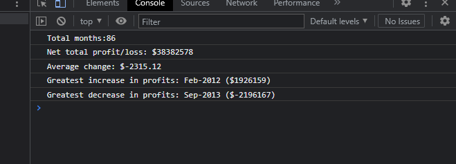

# Bootstrap-Portfolio (Bootcamp Challenge 3)

## Description 
This javascript program processes a list of financial data from a company, including the month and the profit or loss for that month. It then calculates statistics including total number of months, net total profit and loss, average change in profit or loss, greatest increase and decrease in profit, in addition to the dates at which these occured. 

### How to use this program

* Open the index.html file in the repository, this has a script tag in it linked to the index.js file containing the program. 
* The output should be a series of lines printed to the console showing the aforementioned statistics. 

Here is a screenshot of my project. 

### What I have learnt 

* I have gained an understanding of foundational JavaScript syntax and concepts in programming like variables, arrays, and loops. 
* I have learnt how to analyze data stored in an array. 
* I have learnt to calculate statistics based on data in an array using basic JavaScript. 
* I have learnt how to print an output in JavaScript by utilising the 'console.log' function. 
* I maintained semantic structure to my code, for example naming the JavaScript variables in a way that promotes readability and maintainability in my code. 

## Credits 

* https://www.w3schools.com/jsref/jsref_tofixed.asp